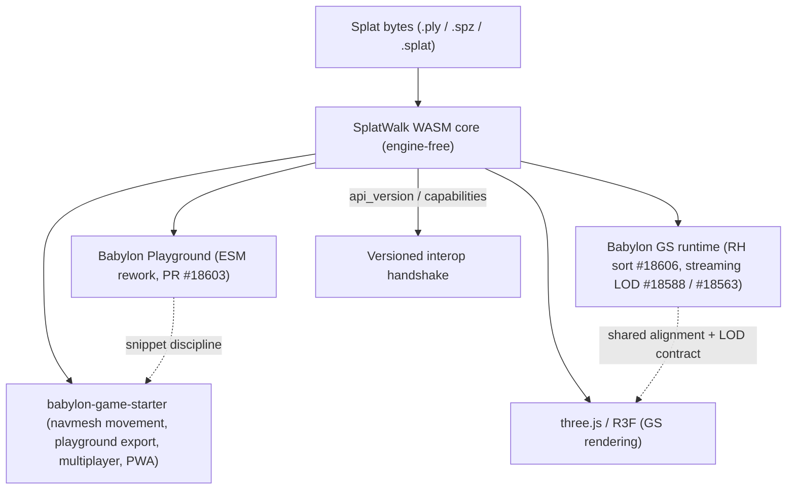

# SplatWalk Mutualism Milestones

This document is a strategic roadmap of **mutualism**: integration milestones
where SplatWalk and the surrounding Gaussian-splat ecosystem advance *together*.
Each milestone names the triggering development, what **SplatWalk gains**, what
the **partner/upstream gains**, and a concrete deliverable.

It is a companion to the streaming-oriented [`MILESTONES.md`](MILESTONES.md) and
the original [`IDEATION.md`](IDEATION.md). Where the two overlap (GS streaming),
this doc frames the *mutual* benefit and links back rather than duplicating.

## The mutualism principle

SplatWalk's product is an **engine-free Rust/WASM core**
([`src/wasm/bridge.ts`](src/wasm/bridge.ts), published as `@splatwalk/core`) that
turns splat bytes into navmesh-ready geometry, bounds, and SOG/GLB — in a
coordinate space the caller controls via `flip_y` / `output_space`, behind a
versioned `api_version` / `capabilities` handshake. Renderers are *consumers*,
not dependencies: the same core drives the Babylon showcase
([`src/scene/Viewer.ts`](src/scene/Viewer.ts)) and the three.js / R3F demo
([`src/react/three/SplatNavController.ts`](src/react/three/SplatNavController.ts)).

Mutualism follows directly from that shape:

- **Fix once, benefit everywhere.** A handedness or streaming-schema fix done at
  the WASM boundary is correct for Babylon, three.js, and any future engine at
  the same time.
- **Return value upstream.** Each milestone produces something the partner can
  use directly — a Playground snippet, an RH regression scene, donated SOG LOD
  test fixtures, a navmesh-handoff contract — not just an internal feature.
- **Tolerate additive change.** The `api_version` / `capabilities` handshake lets
  partners adopt new capabilities without hard-failing on a version bump, so the
  ecosystem can move at different speeds without breaking.

Each of the four recent developments below touches exactly one seam SplatWalk
already owns: Playground packaging, GS handedness, GS streaming LOD, and
navmesh-driven movement.

## Ecosystem map

## Milestone tracks

### Track A — Babylon Playground packaging convergence

**Trigger:** Babylon PR
[#18603](https://github.com/BabylonJS/Babylon.js/pull/18603) — a self-hosted ESM
loading path for the Playground (`import * as BABYLON from "@babylonjs/core"`),
feature-flagged behind `?esm`, with full UMD back-compat and **no third-party
CDN** for Babylon itself.

**Context.** babylon-game-starter already ships a `playground.json` export with a
*static-imports-only* discipline, an ambient `BABYLON` global, and an
export smoke-checker (`check:playground`). The Playground's move to self-hosted
ESM mirrors a constraint SplatWalk's WASM core already lives under: load your own
binary, never lean on an external CDN (the SplatWalk service worker is even
keyed off the wasm hash).

| Direction | Benefit |
| --- | --- |
| SplatWalk gains | A first-class "FAST NAV in the Playground" entry point: a snippet that loads a splat, runs `build_room_floor_mesh`, builds a `recast-navigation` crowd, and enables click-to-move — runnable as a shareable Babylon snapshot. |
| Babylon gains | A real GS-plus-navmesh Playground sample that exercises the new ESM path end to end (self-hosted core, no CDN), suitable as a docs/sample link. |
| babylon-game-starter gains | A drop-in "splat world" snippet that already obeys its static-imports-only + smoke-check export rules. |

**Deliverables**

- A `playground/` snippet (UMD- and ESM-mode compatible) under the SplatWalk
  examples surface.
- A self-hosted-WASM loading note for Playground/snapshot contexts (mirroring
  #18603's no-third-party-CDN goal), with `capabilities`-gated init so the
  snippet degrades cleanly on an older core.

### Track B — Gaussian-splat handedness / right-handed correctness

**Trigger:** Babylon PR
[#18606](https://github.com/BabylonJS/Babylon.js/pull/18606) — GS depth ordering
fix for **right-handed** scenes: a `rightHanded` flag is propagated to the GS
sort worker (driven by `scene.useRightHandedSystem`) so the bucket-sort
invariant ("larger depth = farther") stays true.

**Context.** Handedness is the spine of SplatWalk's integration contract.
[`docs/INTEGRATION.md`](docs/INTEGRATION.md) §9–10 already documents that Babylon
is left-handed (splat loader applies a negative Y scale → `flip_y: true`) while
three.js is right-handed (the demo parents the scene in a `scale.z = -1` group,
a proper 180° rotation about X). PR #18606 is the *runtime* counterpart of the
same problem SplatWalk solves at the geometry boundary: a right-handed splat
scene must sort, render, and navigate on one coherent plane.

| Direction | Benefit |
| --- | --- |
| SplatWalk gains | Validation that its `output_space` (`up_axis` / `handedness` / `winding`) contract aligns with Babylon's new RH sort path; a right-handed regression scene mirroring Babylon's new `gsplat`-RH visualization test. |
| Babylon / three.js gain | A documented, cross-engine "canonical GS alignment recipe" proven by the hardest test there is — a navmesh and crowd that must land exactly on the same plane the splat renders, in both handedness conventions. |

**Deliverables**

- The shared alignment recipe ([`docs/coordinate-alignment.md`](docs/coordinate-alignment.md))
  linking SplatWalk's `flip_y` boundary fix to Babylon's `useRightHandedSystem`
  runtime flag (#18606), plus the typed `output_space` surface and a headless
  winding/up-axis regression ([`examples/handedness-check.mjs`](examples/handedness-check.mjs)).
  Shipped; tracked in issue [#3](https://github.com/EricEisaman/splatwalk/issues/3).
- Right-handed regression scenes. Shipped + verified; follow-up to issue #3.
  - **Babylon `useRightHandedSystem` scene (done):** the Vuetify showcase reads a
    hidden `?rh=1` flag and builds the viewer with `scene.useRightHandedSystem =
    true` ([`src/scene/Viewer.ts`](src/scene/Viewer.ts) `ViewerOptions.rightHanded`).
    Verified numerically on `Bedroom?rh=1`: splat, `navmesh_debug`, and the crowd
    coincide on one floor plane with no boundary mirror (measurements in
    [`docs/coordinate-alignment.md`](docs/coordinate-alignment.md) → "Babylon.js
    (right-handed)").
  - **three.js (resolved by finding):** the R3F demo is already a true
    right-handed scene, but the Z mirror cannot be removed — the bundled splat
    loader imports Y-down, so an upright **and** un-mirrored splat needs a proper
    180-degree rotation that flips Z, making the floor/navmesh Z-reflection
    intrinsic rather than optional (see
    [`docs/coordinate-alignment.md`](docs/coordinate-alignment.md) → "three.js
    (right-handed, native)").

### Track C — GS streaming and SOG LOD

**Trigger:** Babylon PRs
[#18588](https://github.com/BabylonJS/Babylon.js/pull/18588) (streaming LOD part 3
— download manager, eviction, `whenSettledAsync`, a splat-LOD visualization test)
and [#18563](https://github.com/BabylonJS/Babylon.js/pull/18563) (the GS
streaming loader).

**Context.** SplatWalk already emits a streamed SOG bundle — a Morton-ordered,
multi-chunk `lod-meta.json` set with lossless WebP planes — via `sliceSplat` /
`convertToSog` ([`src/wasm/bridge.ts`](src/wasm/bridge.ts)), modeled on Babylon's
`ParseSogMeta` decode path. This track is the *mutualism* framing of the
"Next month — Babylon GS streaming integration" item in
[`MILESTONES.md`](MILESTONES.md).

| Direction | Benefit |
| --- | --- |
| SplatWalk gains | Its interim `lod-meta.json` schema reconciled against the final loader contract; FAST NAV proven on a streamed scene (slice → stream → nav) using `SliceArchive.createBlobDirectory()` as the in-app streaming seam. |
| Babylon gains | Donated, real-world sliced SOG bundles as GS-LOD test fixtures (the kind referenced by the splat-LOD visualization test), produced reproducibly from the WASM encoder. |

**Deliverables**

- A schema-reconciliation checklist (our `slice.rs` version-1 manifest vs. the
  final loader's expected LOD-selection metadata).
- A streamed-nav demo milestone that links back to
  [`MILESTONES.md`](MILESTONES.md) rather than duplicating its detail.

### Track D — babylon-game-starter navmesh movement (primary convergence)

**Trigger:** babylon-game-starter's intent to add a **navmesh-based movement
system** on top of its existing physics movement, Playground export, multiplayer
(Go), and PWA — all on Babylon.js v9.

**Context.** This is the most direct convergence in the set: the starter wants a
navmesh movement backend; SplatWalk produces exactly that — a navmesh binary, a
spawn point, and Recast-ready agent dimensions (`recast_config()` converts metres
to integer voxel counts, avoiding the truncation bug documented in
[`docs/INTEGRATION.md`](docs/INTEGRATION.md) §5). The two projects already share a
stack: Babylon v9, a wasm-hash-keyed service worker / PWA model, and a
playground-export discipline.

| Direction | Benefit |
| --- | --- |
| SplatWalk gains | A full game-framework consumer — HUD, device-adaptive input, multiplayer sync, and PWA packaging — exercising the navmesh handoff in a real game loop. |
| babylon-game-starter gains | Real-world *walkable splat scenes*: a "splat world" environment type whose floor, navmesh, and spawn all come from SplatWalk, with movement constrained to the generated navmesh. |

**Deliverables**

- A navmesh-handoff contract: navmesh binary + spawn point + agent params
  (`recast_agent_defaults()` / `recast_config()`), consumable by the starter's
  environment system.
- A "splat environment type" sketch for the starter (load splat → FAST NAV →
  crowd-constrained movement), plus shared PWA/service-worker and
  playground-export-discipline notes (ties into Track A).

### Track E — three.js GS ecosystem

**Trigger:** SplatWalk's existing R3F reference
([`src/react/three/SplatNavController.ts`](src/react/three/SplatNavController.ts),
route `/react`) renders with
[`@mkkellogg/gaussian-splats-3d`](https://github.com/mkkellogg/GaussianSplats3D)
and drives the same WASM floor module + `recast-navigation` crowd as Babylon;
[three.js](https://github.com/mrdoob/three.js/) itself continues to expand
Gaussian-splat rendering.

| Direction | Benefit |
| --- | --- |
| SplatWalk gains | Continued proof that `@splatwalk/core/floor` is a genuinely engine-agnostic seam — the *identical* floor logic and crowd, only the renderer differs. |
| three.js community gains | A contributable GS-plus-navmesh example and the same right-handed alignment recipe as Track B (three.js is right-handed natively, so the recipe applies with no `flip_y` guesswork). |

**Deliverable**

- A three.js GS-navmesh example aligned to the cross-cutting recipe, tracking
  three.js native GS support as it lands.

## Cross-cutting standards (the mutualism enablers)

These are the shared artifacts that make the tracks above reinforce each other
instead of fragmenting per engine.

1. **Canonical GS alignment recipe (Tracks B, D, E).** One page
   ([`docs/coordinate-alignment.md`](docs/coordinate-alignment.md)): detect
   handedness at the renderer boundary (Babylon `mesh.scaling.y < 0` →
   `flip_y: true`; Babylon RH via `useRightHandedSystem`; three.js `scale.z = -1`
   root), pass it straight into every WASM call, never patch with visual Y
   offsets. The runtime counterpart is Babylon's `rightHanded` sort flag (#18606).
2. **SOG `lod-meta.json` streaming schema (Track C).** A shared, versioned
   streaming contract reconciled with the GS streaming loader, so a SplatWalk
   slice is a drop-in for Babylon's loader and a reproducible test fixture.
3. **Playground export discipline (Tracks A, D).** Static-imports-only, ambient
   `BABYLON` global, self-hosted assets (no third-party CDN), validated by a
   smoke-checker — shared between SplatWalk snippets, the Babylon Playground ESM
   path, and babylon-game-starter's `playground.json` export.
4. **`api_version` / `capabilities` handshake.** The additive-change tolerance
   mechanism every consumer uses to adopt new capabilities without hard-failing
   on a bump (see [`docs/INTEGRATION.md`](docs/INTEGRATION.md) §2).

## Sequencing

Order is chosen so the cheapest, most-unblocking work lands first. Each phase
carries a one-line trigger tied to the upstream development shipping.

| Phase | Track | Trigger condition |
| --- | --- | --- |
| 1 | **B** — alignment recipe + RH scenes | #18606 merged to a Babylon release SplatWalk depends on; cheapest work, unblocks D and E. |
| 2 | **A** — Playground FAST NAV snippet | #18603's ESM path reaches a published Playground / snapshot. |
| 3 | **D** — babylon-game-starter navmesh seam | starter's navmesh movement system begins; depends on Phase 1's recipe. |
| 4 | **C** — streamed-nav + donated fixtures | #18563 / #18588 GS streaming loader ships in production (see [`MILESTONES.md`](MILESTONES.md)). |
| — | **E** — three.js example | runs alongside, reusing Phase 1's recipe; accelerates as three.js native GS matures. |

## Out of scope

This is a roadmap document. It defines contracts, deliverables, and sequencing;
it does not implement code in the WASM core, the demos, or babylon-game-starter.
Each track names follow-up engineering work to be scheduled against its trigger.
