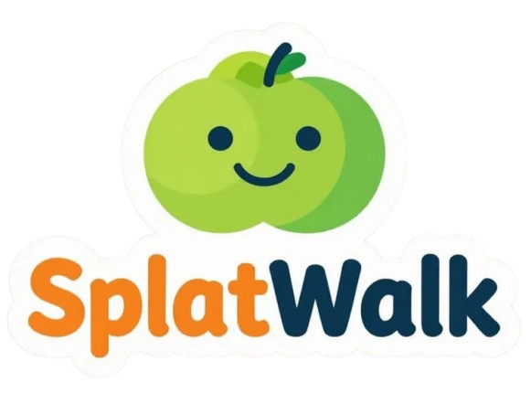

# SplatWalk

**SplatWalk** is a convenient one-stop shop for generating optimized **.glb ground meshes** from **.spz** or **.ply** Gaussian splats as well as creating Recast compatible navmesh binaries, all available to download at the press of a button.

The primary goal of SplatWalk is to provide high-quality Gaussian Splat utilities empowering engineers and designers in their quest to create useful 3D applications.

## Key Features

- **Instant Visualization**: Load and view Gaussian Splat files immediately.
- **Orientation Control**: Rotate and align splats visually before conversion (90° increments).
- **Ground Plane Detection**: High-performance RANSAC-based ground plane extraction.
- **Mesh Reconstruction**: Integrated Poisson reconstruction for full geometry.
- **One-Click Export**: Download production-ready `.glb` files.
- **One-Click Export**: Download production-ready `Recast compatible navmesh binary` files.

## Technology Stack

- **Core**: Rust (compiled to WASM) for heavy geometry processing.
- **Rendering**: Babylon.js for high-performance 3D visualization.
- **Frontend**: TypeScript + Vite for a modern, responsive web experience.

## License

This project is licensed under the **AGPLv3**.
