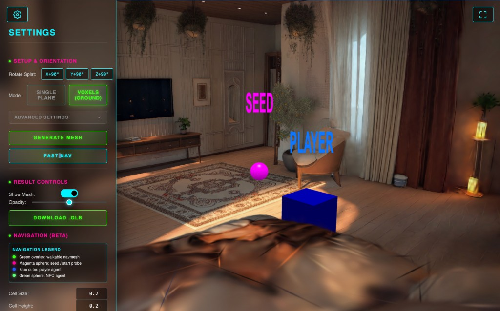

# SplatWalk


**SplatWalk** is a convenient one-stop shop for generating optimized **.glb ground meshes** from **.spz** or **.ply** Gaussian splats as well as creating Recast-compatible navmesh binaries from either a fast floor-field path or a dedicated collision basis.

The primary goal of SplatWalk is to provide high-quality Gaussian Splat utilities empowering engineers and designers in their quest to create useful 3D applications.

## Fast Floor Nav In Action

One `FAST NAV` click takes a raw splat to a walkable navmesh with a spawned, click-to-move player. Here the player agent (blue cube) and seed probe (magenta sphere) are correctly placed on the room floor, on the same plane the splat renders:



## Key Features

- **Instant Visualization**: Load and view Gaussian Splat files immediately.
- **Orientation Control**: Rotate and align splats visually before conversion (90° increments). Rotating a splat after a navmesh exists automatically re-runs the same generation path so the navmesh, spawn point, and agents stay aligned with the re-oriented splat.
- **Fast Floor Nav Path**: One button can pick a seed, extract a walkable floor field, feed that floor mesh to Recast, initialize the crowd, spawn an NPC, and enable click-to-move.
- **Floater Pruning (WASM)**: Built-in statistical outlier removal strips stray "floater" splats at ingest so bounds, region, seed, and floor detection lock onto the real scene. On by default and tunable (see *Built-in floater pruning* below).
- **Advanced Collider NavMesh Basis**: Import a dedicated `.collision.glb` / World Labs Collider Mesh GLB or generate a fallback collider from the splat, then feed only that collider to Recast for manual tuning.
- **PlayCanvas/SuperSplat Workflow**: Supports scene type, seed, voxel fill/seal, carve, and collider mesh diagnostics modeled after the PlayCanvas collision pipeline.
- **Navigation Markers**: The scene labels explain the magenta seed marker, blue player agent, green NPC agent, and green walkable navmesh overlay.
- **2.5D SDF Diagnostics**: Browser-side column fields power the fast floor path and remain available under experimental debug for inspecting accepted, obstacle, variance, and rejected cells.
- **Mesh Reconstruction**: Integrated Poisson reconstruction for full geometry.
- **Streamed SOG Export**: Convert a splat into a SOG bundle — a single `meta.json` set or a streamed, Morton-ordered multi-chunk `lod-meta.json` set with lossless WebP planes — decodable by Babylon's SOG loaders and aimed at the GS streaming loader (PR #18563). Full spherical harmonics (configurable degree); large scenes (>1M splats) default to streamed LOD. See [`docs/wasm-api.md`](docs/wasm-api.md) and [`MILESTONES.md`](MILESTONES.md).
- **Basic `.spz` Support**: `.spz` is normalized to a full-fidelity `.ply` (`spz_to_ply`) so the viewer and nav pipeline only deal with PLY.
- **One-Click Export**: Download production-ready `.glb` files.
- **One-Click Export**: Download production-ready `Recast compatible navmesh binary` files.

## Technology Stack

- **Core**: Rust (compiled to WASM) for heavy geometry processing.
- **Rendering**: Babylon.js for high-performance 3D visualization.
- **Frontend**: TypeScript + Vite for a modern, responsive web experience.

## Using SplatWalk In Your Project (Early Integrators)

> SplatWalk is early software. The WASM core is the product — the browser UI is a reference harness around it. Treat the WASM result shapes as a versioned contract (every result carries `api_version`).

There are two supported integration levels:

1. **TypeScript bridge** (`src/wasm/bridge.ts`): a thin typed wrapper around the WASM exports. Easiest path if you already use a bundler.
2. **Raw WASM binary** (`pkg/wasm_splatwalk/wasm_splatwalk.js` + `wasm_splatwalk_bg.wasm`): consume the generated glue and binary directly from any engine. Always pin the glue and `.wasm` from the same build.

### Minimal one-button floor-nav flow

```ts
import { SplatWalkBridge } from "splatwalk/wasm/bridge";

const splatwalk = SplatWalkBridge.getInstance();
await splatwalk.init();

// `flip_y` must match how your renderer displays the splat. Gaussian-splat loaders
// (e.g. Babylon) import with a negative Y scale, so pass flip_y=true to keep the
// navmesh, basis, and spawn points on the SAME plane your renderer draws the splat.
const settings = {
  mode: 2,
  flip_y: true,            // set from your renderer's actual splat Y-scale sign
  rotation: [0, 0, 0],     // any user orientation, in radians (applied in WASM)
  // ...fast-floor preset values (see docs/wasm-api.md "Settings Notes")
};

// 1) Find a floor seed, 2) extract the walkable ground field.
const region = splatwalk.suggestRegion(bytes, settings);
const field = splatwalk.buildWalkableGroundField(bytes, settings);

// 3) Keep only walkable/filled cells, pick the seed-nearest connected component,
//    triangulate it, and feed that floor mesh to Recast (see src/pages/splatwalk.ts).
```

> When you build the Recast config yourself, pass the agent dimensions
> (`walkableHeight`/`walkableClimb`/`walkableRadius`) in **voxel units**, not metres:
> Recast truncates them to integers, so sub-metre metre values collapse to `0` and
> fragment the navmesh. See [Recast parameter units (metres vs voxels)](docs/wasm-api.md#recast-parameter-units-metres-vs-voxels).

### Coordinate alignment (read this first)

The single most common integration bug is a navmesh that is mirrored or offset from the rendered splat. SplatWalk parses raw PLY/SPZ coordinates, but renderers usually flip Y on import. Resolve it once, at the boundary:

- Set `flip_y` from your renderer's actual splat transform (the sign of its world Y scale), not a guess. When set, WASM negates the Y of every parsed splat (position and normal) so it operates in the same world space you render, and its `+Y = up` floor/clearance heuristics become valid.
- Pass user orientation via `settings.rotation` (radians). WASM bakes it into bounds, regions, meshes, basis, and the ground field, so re-running after a rotation re-aligns everything.
- Do **not** derive floor height from renderer meshes or apply visual Y offsets to "fix" alignment. Fix `flip_y`/`rotation`/settings instead.

See [`docs/wasm-api.md`](docs/wasm-api.md) for the full entry-point contract, the ground-field cell states, settings reference, and binary-only integrator guidance.

### Reusable Vue/Vuetify component

The reference UI ships as a drop-in Vuetify component and a headless composable, both re-exported from `src/index.ts`:

```ts
import {
  SplatFastNavShowcase,        // full Vuetify card (drop/browse/example -> FAST NAV)
  useSplatFastNav,             // headless flow for your own UI
  DEFAULT_EXAMPLE_SCENES,
  DEFAULT_FAST_NAV_RECOVERY,
} from "splatwalk";
```

### Built-in adaptive FAST NAV recovery

Large or sparse splats can produce a floor field that is mostly empty, which used to fail with `Fast nav floor is too small to be a room`. FAST NAV now ships with an **adaptive recovery ladder** that is **on by default at every layer** (the component, the `useSplatFastNav` composable, and the `runFastNav` function). On a floor-extraction failure it automatically escalates the extraction parameters (coarser cells, lower density threshold, higher variance tolerance, higher voxel target, lower confidence) and only relaxes the room-area gate as a last resort, logging each step before retrying.

```vue
<!-- Recovery is built-in; nothing to wire up: -->
<SplatFastNavShowcase />

<!-- Override or extend the ladder (e.g. add your own last-resort step): -->
<SplatFastNavShowcase
  :recovery="{ steps: [...DEFAULT_FAST_NAV_RECOVERY.steps, myExtraStep] }"
  :example-scenes="myScenes"
/>
```

The same config is available when driving the pipeline yourself:

```ts
// Headless composable:
const flow = useSplatFastNav(babylon, { recovery: myRecovery });

// Or the function directly (omit `recovery` to use DEFAULT_FAST_NAV_RECOVERY):
await runFastNav({ viewer, bytes, recovery: myRecovery });
```

A recovery step is `{ label, settings: Partial<MeshSettings>, minRoomFloorArea }`; each `settings` is merged over the base fast-field settings. See `DEFAULT_FAST_NAV_RECOVERY` in [`src/navigation/fastNav.ts`](src/navigation/fastNav.ts) for the shipped ladder.

### Built-in floater pruning (WASM statistical outlier removal)

Large, real-world scans almost always contain **stray "floater" splats** — sparse points hanging in the air or below the real floor. They inflate the scene bounds and drag the auto-detected floor/region/seed away from the actual room. SplatWalk removes them at the source with a **statistical outlier removal** pass (same idea as SuperSplat's "remove outliers"): for every splat it measures the mean distance to its `k` nearest neighbours and drops splats whose mean distance exceeds `mean + std_ratio * stddev` of that distribution.

This runs inside the WASM ingest chokepoint (`parse_splats`), so it applies to **every** WASM entry point automatically — `get_splat_bounds`, `suggest_region`, `convert_splat_to_mesh`, `convert_splat_to_navmesh_basis`, and `build_walkable_ground_field`. Bounds, region suggestion, seed placement, the floor field, and the reconstructed mesh all see the cleaned point set. It is **on by default**, rigid-motion invariant, and includes a safety cap: if a pass would remove more than 40% of the scene it is skipped (and logged) so legitimate geometry is never destroyed.

#### WASM `MeshSettings` fields

| Field | Type | Default | Meaning |
| --- | --- | --- | --- |
| `prune_floaters` | `boolean` | `true` | Enable statistical outlier removal before any geometry/region/seed computation. |
| `prune_floaters_k` | `number` | `16` | Neighbours sampled per splat. Higher = smoother/more conservative estimate. |
| `prune_floaters_std_ratio` | `number` | `2.0` | Keep splats within `mean + std_ratio * stddev`. **Lower = more aggressive.** |

These are passed in the same `MeshSettings` object as every other knob:

```ts
import { splatwalk } from '@/wasm/bridge';

// All bridge ops are async (they run in a Web Worker — see "Off-main-thread" below).
const field = await splatwalk.buildWalkableGroundField(bytes, {
  mode: 2,
  // ...other settings...
  prune_floaters: true,        // default; set false to keep every splat
  prune_floaters_k: 16,        // default
  prune_floaters_std_ratio: 2.0, // default; try 1.0–1.5 for heavy floaters
});
```

#### From the component / composable / `runFastNav`

Pruning is on by default through every layer. Override or tune it with the `prune` option (`PruneFloatersOptions`):

```vue
<!-- Keep every splat (disable pruning): -->
<SplatFastNavShowcase :prune="{ enabled: false }" />

<!-- More aggressive pruning for very floater-heavy scans: -->
<SplatFastNavShowcase :prune="{ k: 24, stdRatio: 1.2 }" />
```

```ts
// Composable:
const flow = useSplatFastNav(babylon, { prune: { stdRatio: 1.5 } });

// Function directly (omit `prune` to use the defaults):
await runFastNav({ viewer, bytes, prune: { enabled: false } });
```

On the homepage workbench the same controls live under **Reconstruction** as *Prune Floaters* (toggle), *Prune Neighbours (K)*, and *Prune Strength (σ)*. Each pass logs a line such as `Pruned 12,431 floater splats (k=16, std_ratio=2.00): 980,112 -> 967,681` (or `Floater prune skipped (...)` when the safety cap or a degenerate input applies).

### Off-main-thread execution, caching, and progress

All splat WASM work — parsing, floater pruning, region suggestion, the floor field, and mesh reconstruction — runs in a dedicated **Web Worker** (`src/wasm/splat.worker.ts`), so heavy scans never lock up UI interaction. The `splatwalk` bridge (`src/wasm/bridge.ts`) is therefore an **async proxy**: every op returns a `Promise`.

- **Load-once data transfer**: the splat bytes are transferred to the worker once per file and reused for all subsequent ops, so the (potentially large) buffer isn't re-copied per call.
- **Parse + prune cache**: the worker's WASM caches the parsed+pruned point cloud keyed by content + prune settings, so the multiple ops in a single FAST NAV run (region suggestion, recovery ladder, re-seed) don't re-parse the PLY or re-run the prune.
- **Throttled progress**: the prune pass emits a real percentage (capped at ~100 ticks so it never floods the event loop). Workers aren't subject to the main thread's "unresponsive script" timeout, so long passes complete safely. Other stages (PLY parse, field build) intentionally report a **stage label with an indeterminate indicator** rather than a fabricated bar — instrumenting them would add per-iteration overhead for no real accuracy gain.

Wire the progress/busy signals into your own UI:

```ts
import { splatwalk } from '@/wasm/bridge';

splatwalk.onBusyChange = (busy) => { /* show/hide a spinner */ };
splatwalk.onProgress = (stage, fraction) => {
  // stage: 'parse' | 'prune' | 'field' | ...; fraction: 0..1 or null (indeterminate)
};
```

The bundled `useSplatFastNav` composable already exposes this as reactive state — `phase` (`'prune' | 'floor' | 'navmesh' | 'done'`) and `progress` (`{ stage, fraction }`) — and `runFastNav` accepts an `onPhase` callback. The `SplatFastNavShowcase` component uses them to drive its step chips (including a live **Prune outliers NN%** step) and a determinate progress ring, so integrators get the processing feedback for free. The homepage workbench shows the same via a spinner overlay with a stage label and percentage.

## Service Worker and Caching

SplatWalk ships a service worker (`public/sw.js`) whose cache id is derived from the wasm build:

- **Auto-versioned cache**: During `npm run build`, a Vite plugin hashes `pkg/wasm_splatwalk/wasm_splatwalk_bg.wasm` and writes that hash into the service worker's `CACHE_NAME` (replacing the `__SW_BUILD_ID__` placeholder). Every new wasm build therefore produces a new cache id.
- **Clears on change**: On activation the service worker deletes every cache whose name is not the current `CACHE_NAME`, so previous builds are evicted automatically.
- **Hands-off updates**: The client checks for a new worker on load, tells it to skip waiting, and reloads once when it takes control. Integrators never have to manually discard cache to pick up a new build.
- **No stale code**: Application code, wasm binaries/glue, splat assets, workers, and any query-stringed request bypass the cache entirely (network passthrough). Only the static shell is cached network-first.
- **Dev**: The service worker is not registered on `localhost`; any previously registered worker and its caches are unregistered/cleared on startup so dev never serves stale wasm.

## License

This project is licensed under the **AGPLv3**.
