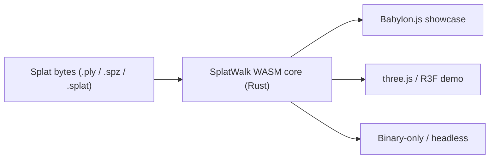

<div align="center">

# SplatWalk


### The render-engine-agnostic toolkit for Gaussian splats.

**Splat bytes in. Walkable worlds out.**

[](LICENSING.md)
[](https://www.npmjs.com/package/@splatwalk/core)
[](#technology-stack)
[](#render-engine-agnostic-by-design)
[](#render-engine-agnostic-by-design)

</div>

**SplatWalk** turns raw **`.ply`**, **`.spz`**, and **`.splat`** Gaussian splats into production-ready, *navigable* 3D: optimized **`.glb` ground meshes** and **Recast-compatible navmesh binaries** — built either from a one-click fast floor-field path or from a dedicated collision basis.

At its heart is a single **Rust-to-WASM core** with **zero dependency on any 3D engine, renderer, or UI framework**. It takes splat bytes in and returns meshes, navmesh-ready geometry, bounds, and SOG/GLB out — in a coordinate space *you* control. The mission is simple: give engineers and designers high-performance Gaussian Splat tooling that empowers them to ship real 3D applications, on whatever stack they already love.

## Render-Engine Agnostic by Design

The engine-free WASM core is the product; renderers are just consumers. The **same** core powers every reference integration in this repo — only the rendering and crowd glue differ:

- **Engine-free core, by contract** — pure Rust/WASM. No Babylon, no three.js, no bundler required. Splat bytes go in; meshes, navmesh geometry, bounds, and SOG/GLB come out.
- **You own the coordinate space** — align to any renderer once, at the boundary, via `flip_y` / `output_space`. No per-output hacks.
- **Proven on multiple stacks** — a **Babylon.js** showcase (WebGPU preferred with WebGL fallback, in-demo toggle or `?renderer=`) and a **React Three Fiber / three.js** demo (WebGL) call the *identical* WASM entry points and the shared, engine-free floor module.
- **Binary-only friendly** — drive the whole pipeline headless, with **no 3D engine at all** (see [`examples/`](examples/)).


```mermaid
flowchart LR
    splat["Splat bytes (.ply / .spz / .splat)"] --> core["SplatWalk WASM core (Rust)"]
    core --> babylon["Babylon.js showcase"]
    core --> three["three.js / R3F demo"]
    core --> headless["Binary-only / headless"]
```

> Versioned contract: every WASM result carries `api_version` plus `capabilities`, so you can tolerate additive change instead of hard-failing on a bump. See the [Integration Guide](docs/INTEGRATION.md).

## Fast Floor Nav In Action

One **`FAST NAV`** click takes a raw splat all the way to a walkable navmesh with a spawned, click-to-move player. Below, the player agent (blue cube) and seed probe (magenta sphere) land precisely on the room floor — on the very same plane the splat renders:


## Key Features

- **Instant Visualization** — Load and view Gaussian Splat files the moment they land.
- **Orientation Control** — Rotate and align splats visually before conversion (90° increments). Rotate a splat *after* a navmesh exists and SplatWalk automatically re-runs the same generation path, so the navmesh, spawn point, and agents stay locked to the re-oriented splat.
- **Fast Floor Nav Path** — One button picks a seed, extracts a walkable floor field, feeds that floor mesh to Recast, initializes the crowd, spawns an NPC, and enables click-to-move.
- **Floater Pruning (WASM)** — Built-in statistical outlier removal strips stray "floater" splats at ingest so bounds, region, seed, and floor detection lock onto the real scene. On by default and fully tunable (see *Built-in floater pruning* below).
- **Advanced Collider NavMesh Basis** — Import a dedicated `.collision.glb` / World Labs Collider Mesh GLB, or generate a fallback collider from the splat, then feed only that collider to Recast for hands-on tuning.
- **PlayCanvas / SuperSplat Workflow** — Scene type, seed, voxel fill/seal, carve, and collider mesh diagnostics, modeled after the PlayCanvas collision pipeline.
- **Navigation Markers** — The scene labels the magenta seed marker, blue player agent, green NPC agent, and green walkable navmesh overlay.
- **2.5D SDF Diagnostics** — Browser-side column fields power the fast floor path and stay available under experimental debug for inspecting accepted, obstacle, variance, and rejected cells.
- **Mesh Reconstruction** — Integrated Poisson reconstruction for full geometry.
- **Streamed SOG Export** — Convert a splat into a SOG bundle — a single `meta.json` set or a streamed, Morton-ordered multi-chunk `lod-meta.json` set with lossless WebP planes — decodable by Babylon's SOG loaders and aimed at the GS streaming loader (PR #18563). Full spherical harmonics (configurable degree); large scenes (>1M splats) default to streamed LOD. See [`docs/wasm-api.md`](docs/wasm-api.md), [`MILESTONES.md`](MILESTONES.md), and the ecosystem roadmap in [`MUTUALISM_MILESTONES.md`](MUTUALISM_MILESTONES.md).
- **`.spz` / `.splat` Support** — `.spz` (Niantic) and `.splat` (antimatter15) are normalized to a full-fidelity `.ply` in WASM at ingest (`spz_to_ply` / `splat_to_ply`) so the viewer drives only Babylon's PLY loader (no CDN-hosted `.spz` decoder) and the nav pipeline only ever deals with PLY.
- **One-Click Export** — Download production-ready `.glb` meshes and Recast-compatible navmesh binaries.

## Technology Stack

- **Core (the product)** — Rust, compiled to WASM, for high-performance geometry processing. Engine-free and renderer-agnostic by contract.
- **Reference integrations** — Babylon.js and React Three Fiber / three.js demos that *consume* the same core. They showcase the pipeline; they are not a rendering dependency of it.
- **Frontend** — TypeScript + Vite for a modern, responsive reference web experience.

## Using SplatWalk In Your Project (Early Integrators)

> SplatWalk is early software, but the contract is intentional. The WASM core is the product — the browser UI is a reference harness around it. Treat the WASM result shapes as a versioned contract (every result carries `api_version`).

> **New here?** Start with the [Integration Guide](docs/INTEGRATION.md) and the runnable [`examples/`](examples/). Install the published core with `npm install @splatwalk/core` (MIT, free forever).

### Download FastNav kits

Each live demo has a **Download … kit** button that ships a zip under `/integration-kits/` (built by `npm run build:kits`):

| Demo | Route | Kit zip |
| --- | --- | --- |
| Vuetify + Babylon FastNav | [`/vuetify`](vuetify.html) | `splatwalk-fastnav-vuetify.zip` |
| React / R3F FastNav | [`/react`](react.html) | `splatwalk-fastnav-r3f.zip` |
| Storage Adapter | [`/storage-adapter`](storage-adapter-app.html) | `splatwalk-storage-adapter.zip` |
| 3D Workbench | [`/`](index.html) | `splatwalk-fastnav-babylon-workbench.zip` |
| Babylon Playground | [`/playground/`](public/playground/index.html) | **Download FastNav playground** → `playground.json` |

Each zip includes `INTEGRATE.md` and `package.peers.json`. Babylon demos expose a **WebGPU / WebGL** toggle (WebGPU uses raised color-attachment limits for GS work buffers). The R3F demo shows the same control with WebGPU disabled — the Three splat path is WebGL-only.

There are two supported integration levels:

1. **Published core** (`@splatwalk/core`): the wasm binary, wasm-bindgen glue, hand-authored types, and the framework-agnostic `floor` module, versioned together. `npm install @splatwalk/core`.
2. **TypeScript bridge** (`src/wasm/bridge.ts`): a thin typed wrapper around the WASM exports if you build from this repo with a bundler.

### Try it in the Babylon.js Playground (zero install)

A copy-paste [Babylon.js Playground](https://playground.babylonjs.com) snippet that is a full interactive demo — a workbench-style experience with its own in-scene UI (in the spirit of [babylon-game-starter](https://github.com/EricEisaman/babylon-game-starter)). It loads `@splatwalk/core` from a CDN, renders a real Gaussian splat, runs `build_room_floor_mesh` to extract the walkable floor (respecting the `flip_y` contract), builds a **Babylon Recast navmesh** from that floor, spawns a crowd agent, and lets you **click the floor to walk** the agent around the splat world. A scene picker switches between example `.ply`/`.spz` splats; toggles show/hide the splat, floor, and navmesh; and a **Full screen** toggle hijacks the Playground split so the canvas fills the view (`?fullscreen=true` enables it on load).

- **Snippet (TypeScript Playground form):** [`public/playground/babylon-fast-nav.ts`](public/playground/babylon-fast-nav.ts) — paste into the Playground's TS editor and Run. The snippet builds its own UI, so the experience is identical in the real Playground.
- **Runnable demo:** open **`/playground/`** on the dev server (`npm run dev` → <http://localhost:5173/playground/index.html>) or the deployed site. Source: [`public/playground/index.html`](public/playground/index.html). It reproduces the Playground TS pipeline (same Babylon CDN build, in-browser transpile) and adds a **Download FastNav playground** button (`playground.json` V2 snippet). The Playground **host** owns WebGL/WebGPU (see [`public/playground/PLAYGROUND_README.md`](public/playground/PLAYGROUND_README.md)). An **Open Playground ↗** button opens the saved snippet directly, and a home icon links back to this site.

> Served from `public/` so Vite/your bundler ships it **verbatim** — the in-browser TypeScript transpile (and the `playground.json` export) need the raw source, not a bundler-rewritten module. The navmesh uses Babylon's `RecastJSPlugin` (recast.js loaded from the Babylon CDN), the same path that runs inside the real Playground.
- **Saved Playground:** <https://playground.babylonjs.com/#VXTB9K>

> **CDN / sandbox caveats.** jsDelivr and unpkg serve the `.wasm` as `application/wasm` with `access-control-allow-origin: *`, so streaming instantiation works (wasm-bindgen also falls back to non-streaming `instantiate` if a CDN ever serves the wrong MIME type). Fetch your splat from a CORS-enabled host — `raw.githubusercontent.com` sends `access-control-allow-origin: *`.

### Minimal one-button floor-nav flow

```ts
import { SplatWalkBridge } from "splatwalk/wasm/bridge";

const splatwalk = SplatWalkBridge.getInstance();
await splatwalk.init();

// `flip_y` must match how your renderer displays the splat. Gaussian-splat loaders
// (e.g. Babylon) import with a negative Y scale, so pass flip_y=true to keep the
// navmesh, basis, and spawn points on the SAME plane your renderer draws the splat.
const settings = {
  mode: 2,
  flip_y: true,            // set from your renderer's actual splat Y-scale sign
  rotation: [0, 0, 0],     // any user orientation, in radians (applied in WASM)
  // ...fast-floor preset values (see docs/wasm-api.md "Settings Notes")
};

// 1) Find a floor seed, 2) extract the walkable ground field.
const region = splatwalk.suggestRegion(bytes, settings);
const field = splatwalk.buildWalkableGroundField(bytes, settings);

// 3) Keep only walkable/filled cells, pick the seed-nearest connected component,
//    triangulate it, and feed that floor mesh to Recast (see src/pages/splatwalk.ts).
```

> When you build the Recast config yourself, pass the agent dimensions
> (`walkableHeight`/`walkableClimb`/`walkableRadius`) in **voxel units**, not metres:
> Recast truncates them to integers, so sub-metre metre values collapse to `0` and
> fragment the navmesh. See [Recast parameter units (metres vs voxels)](docs/wasm-api.md#recast-parameter-units-metres-vs-voxels).

### Coordinate alignment (read this first)

The single most common integration bug is a navmesh that is mirrored or offset from the rendered splat. SplatWalk parses raw PLY/SPZ coordinates, but renderers usually flip Y on import. Resolve it once, at the boundary:

- Set `flip_y` from your renderer's actual splat transform (the sign of its world Y scale), not a guess. When set, WASM negates the Y of every parsed splat (position and normal) so it operates in the same world space you render, and its `+Y = up` floor/clearance heuristics become valid.
- Pass user orientation via `settings.rotation` (radians). WASM bakes it into bounds, regions, meshes, basis, and the ground field, so re-running after a rotation re-aligns everything.
- Do **not** derive floor height from renderer meshes or apply visual Y offsets to "fix" alignment. Fix `flip_y`/`rotation`/settings instead.

See the one-page [Canonical GS Alignment Recipe](docs/coordinate-alignment.md) for the cross-engine handedness/`flip_y`/`output_space` rule, and [`docs/wasm-api.md`](docs/wasm-api.md) for the full entry-point contract, the ground-field cell states, settings reference, and binary-only integrator guidance.

### Reusable Vue/Vuetify component

The reference UI ships as a drop-in Vuetify component and a headless composable, both re-exported from `src/index.ts`:

```ts
import {
  SplatFastNavShowcase,        // full Vuetify card (drop/browse/example -> FAST NAV)
  useSplatFastNav,             // headless flow for your own UI
  DEFAULT_EXAMPLE_SCENES,
  DEFAULT_FAST_NAV_RECOVERY,
} from "splatwalk";
```

### Built-in adaptive FAST NAV recovery

Large or sparse splats can produce a floor field that is mostly empty, which used to fail with `Fast nav floor is too small to be a room`. FAST NAV now ships with an **adaptive recovery ladder** that is **on by default at every layer** (the component, the `useSplatFastNav` composable, and the `runFastNav` function). On a floor-extraction failure it automatically escalates the extraction parameters (coarser cells, lower density threshold, higher variance tolerance, higher voxel target, lower confidence) and only relaxes the room-area gate as a last resort, logging each step before retrying.

```vue
<!-- Recovery is built-in; nothing to wire up: -->
<SplatFastNavShowcase />

<!-- Override or extend the ladder (e.g. add your own last-resort step): -->
<SplatFastNavShowcase
  :recovery="{ steps: [...DEFAULT_FAST_NAV_RECOVERY.steps, myExtraStep] }"
  :example-scenes="myScenes"
/>
```

The same config is available when driving the pipeline yourself:

```ts
// Headless composable:
const flow = useSplatFastNav(babylon, { recovery: myRecovery });

// Or the function directly (omit `recovery` to use DEFAULT_FAST_NAV_RECOVERY):
await runFastNav({ viewer, bytes, recovery: myRecovery });
```

A recovery step is `{ label, settings: Partial<MeshSettings>, minRoomFloorArea }`; each `settings` is merged over the base fast-field settings. See `DEFAULT_FAST_NAV_RECOVERY` in [`src/navigation/fastNav.ts`](src/navigation/fastNav.ts) for the shipped ladder.

### Built-in floater pruning (WASM statistical outlier removal)

Large, real-world scans almost always contain **stray "floater" splats** — sparse points hanging in the air or below the real floor. They inflate the scene bounds and drag the auto-detected floor/region/seed away from the actual room. SplatWalk removes them at the source with a **statistical outlier removal** pass (same idea as SuperSplat's "remove outliers"): for every splat it measures the mean distance to its `k` nearest neighbours and drops splats whose mean distance exceeds `mean + std_ratio * stddev` of that distribution.

This runs inside the WASM ingest chokepoint (`parse_splats`), so it applies to **every** WASM entry point automatically — `get_splat_bounds`, `suggest_region`, `convert_splat_to_mesh`, `convert_splat_to_navmesh_basis`, and `build_walkable_ground_field`. Bounds, region suggestion, seed placement, the floor field, and the reconstructed mesh all see the cleaned point set. It is **on by default**, rigid-motion invariant, and includes a safety cap: if a pass would remove more than 40% of the scene it is skipped (and logged) so legitimate geometry is never destroyed.

#### WASM `MeshSettings` fields

| Field | Type | Default | Meaning |
| --- | --- | --- | --- |
| `prune_floaters` | `boolean` | `true` | Enable statistical outlier removal before any geometry/region/seed computation. |
| `prune_floaters_k` | `number` | `16` | Neighbours sampled per splat. Higher = smoother/more conservative estimate. |
| `prune_floaters_std_ratio` | `number` | `2.0` | Keep splats within `mean + std_ratio * stddev`. **Lower = more aggressive.** |

These are passed in the same `MeshSettings` object as every other knob:

```ts
import { splatwalk } from '@/wasm/bridge';

// All bridge ops are async (they run in a Web Worker — see "Off-main-thread" below).
const field = await splatwalk.buildWalkableGroundField(bytes, {
  mode: 2,
  // ...other settings...
  prune_floaters: true,        // default; set false to keep every splat
  prune_floaters_k: 16,        // default
  prune_floaters_std_ratio: 2.0, // default; try 1.0–1.5 for heavy floaters
});
```

#### From the component / composable / `runFastNav`

Pruning is on by default through every layer. Override or tune it with the `prune` option (`PruneFloatersOptions`):

```vue
<!-- Keep every splat (disable pruning): -->
<SplatFastNavShowcase :prune="{ enabled: false }" />

<!-- More aggressive pruning for very floater-heavy scans: -->
<SplatFastNavShowcase :prune="{ k: 24, stdRatio: 1.2 }" />
```

```ts
// Composable:
const flow = useSplatFastNav(babylon, { prune: { stdRatio: 1.5 } });

// Function directly (omit `prune` to use the defaults):
await runFastNav({ viewer, bytes, prune: { enabled: false } });
```

On the homepage workbench the same controls live under **Reconstruction** as *Prune Floaters* (toggle), *Prune Neighbours (K)*, and *Prune Strength (σ)*. Each pass logs a line such as `Pruned 12,431 floater splats (k=16, std_ratio=2.00): 980,112 -> 967,681` (or `Floater prune skipped (...)` when the safety cap or a degenerate input applies).

### Off-main-thread execution, caching, and progress

All splat WASM work — parsing, floater pruning, region suggestion, the floor field, and mesh reconstruction — runs in a dedicated **Web Worker** (`src/wasm/splat.worker.ts`), so heavy scans never lock up UI interaction. The `splatwalk` bridge (`src/wasm/bridge.ts`) is therefore an **async proxy**: every op returns a `Promise`.

- **Load-once data transfer**: the splat bytes are transferred to the worker once per file and reused for all subsequent ops, so the (potentially large) buffer isn't re-copied per call.
- **Parse + prune cache**: the worker's WASM caches the parsed+pruned point cloud keyed by content + prune settings, so the multiple ops in a single FAST NAV run (region suggestion, recovery ladder, re-seed) don't re-parse the PLY or re-run the prune.
- **Throttled progress**: the prune pass emits a real percentage (capped at ~100 ticks so it never floods the event loop). Workers aren't subject to the main thread's "unresponsive script" timeout, so long passes complete safely. Other stages (PLY parse, field build) intentionally report a **stage label with an indeterminate indicator** rather than a fabricated bar — instrumenting them would add per-iteration overhead for no real accuracy gain.

Wire the progress/busy signals into your own UI:

```ts
import { splatwalk } from '@/wasm/bridge';

splatwalk.onBusyChange = (busy) => { /* show/hide a spinner */ };
splatwalk.onProgress = (stage, fraction) => {
  // stage: 'parse' | 'prune' | 'field' | ...; fraction: 0..1 or null (indeterminate)
};
```

The bundled `useSplatFastNav` composable already exposes this as reactive state — `phase` (`'prune' | 'floor' | 'navmesh' | 'done'`) and `progress` (`{ stage, fraction }`) — and `runFastNav` accepts an `onPhase` callback. The `SplatFastNavShowcase` component uses them to drive its step chips (including a live **Prune outliers NN%** step) and a determinate progress ring, so integrators get the processing feedback for free. The homepage workbench shows the same via a spinner overlay with a stage label and percentage.

## Service Worker and Caching

SplatWalk ships a service worker (`public/sw.js`) whose cache id is derived from the wasm build, so updates are seamless and stale code never lingers:

- **Auto-versioned cache**: During `npm run build`, a Vite plugin hashes `pkg/wasm_splatwalk/wasm_splatwalk_bg.wasm` and writes that hash into the service worker's `CACHE_NAME` (replacing the `__SW_BUILD_ID__` placeholder). Every new wasm build therefore produces a new cache id.
- **Clears on change**: On activation the service worker deletes every cache whose name is not the current `CACHE_NAME`, so previous builds are evicted automatically.
- **Hands-off updates**: The client checks for a new worker on load, tells it to skip waiting, and reloads once when it takes control. Integrators never have to manually discard cache to pick up a new build.
- **No stale code**: Application code, wasm binaries/glue, splat assets, workers, and any query-stringed request bypass the cache entirely (network passthrough). Only the static shell is cached network-first.
- **Dev**: The service worker is not registered on `localhost`; any previously registered worker and its caches are unregistered/cleared on startup so dev never serves stale wasm.

## License

SplatWalk follows an **open-core** model.

- **The core is MIT — and free forever.** The WASM binary, the wasm-bindgen glue, the hand-authored TypeScript types, and the framework-agnostic `floor` module — published as **`@splatwalk/core`** — are licensed under the **MIT License**, including for commercial and proprietary use. Anything released under MIT stays MIT.
- **Pro is opt-in, never required.** Advanced capabilities are reserved for a future commercial tier (`@splatwalk/core-pro`) under a separate license; the core never depends on it.

See [`LICENSING.md`](LICENSING.md) for the package-to-license map and [`CONTRIBUTING.md`](CONTRIBUTING.md) for the contributor sign-off.
