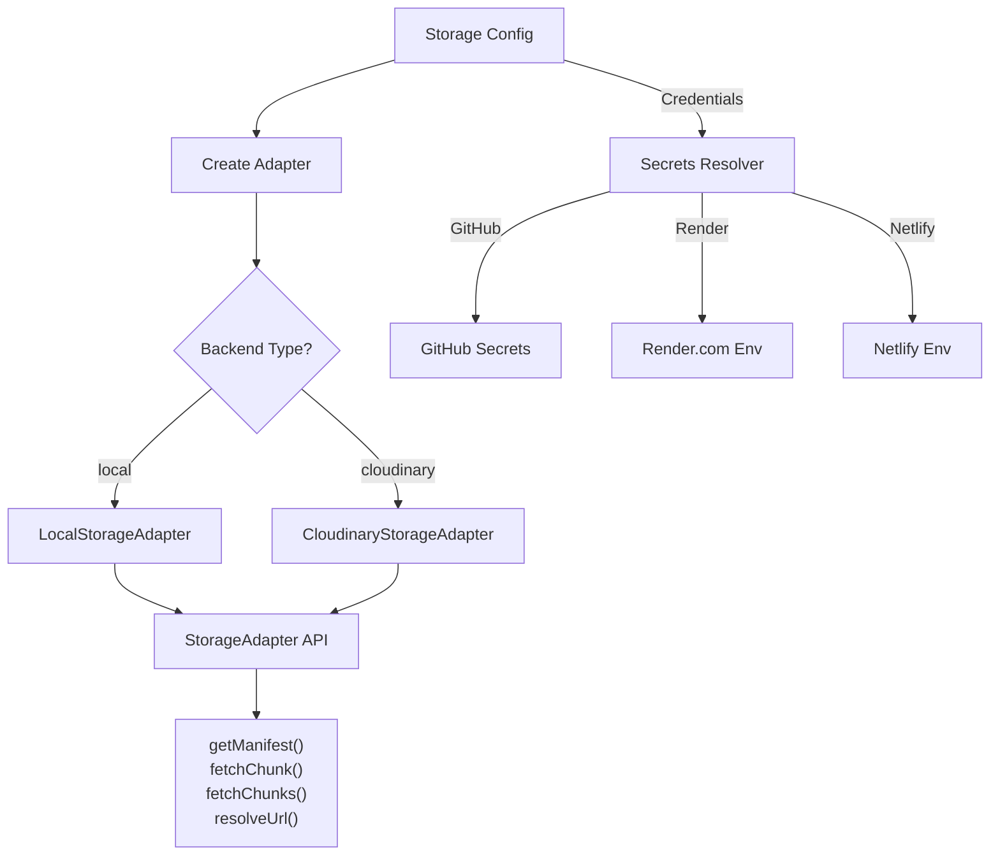

# SOG LOD Storage Adapter System

A clean, unified interface for streaming Spatially Ordered Gaussians (SOG) LOD splats from various backends with secure credential management.

## Overview

The storage adapter system enables SplatWalk to serve SOG bundles from multiple sources:

- **Local Storage** - Zip file uploads for preview and testing
- **Cloudinary** - CDN delivery with global edge caching
- **Extensible** - Framework for S3, Azure Blob, Google Cloud Storage, etc.

All backends support secure credential management through:
- **GitHub Secrets** (GitHub Actions, Codespaces)
- **Render.com** Environment variables
- **Netlify** Environment variables

## Architecture



## Quick Start

### 1. Local ZIP Upload

```typescript
import { createStorageAdapter } from '@splatwalk/storage';

// User uploads a SOG bundle ZIP
const file = document.querySelector('input[type="file"]').files[0];

const { adapter, manifestUrl } = await createStorageAdapter({
  type: 'local',
  source: file,
});

// Stream chunks
const manifest = await adapter.getManifest();
const chunk = await adapter.fetchChunk('lod0/chunk0/means_l.webp');
```

### 2. Cloudinary with GitHub Secrets

```typescript
// GitHub Actions automatically provides secrets
const { adapter } = await createStorageAdapter({
  type: 'cloudinary',
  cloudName: { type: 'github', key: 'CLOUDINARY_CLOUD_NAME' },
  folder: 'sog-bundles',
});

const manifest = await adapter.getManifest();
```

### 3. Setup GitHub Secrets

```bash
# In your GitHub repository:
# Settings → Secrets and variables → Actions → New repository secret

CLOUDINARY_CLOUD_NAME: my-cloud
CLOUDINARY_API_KEY: your-api-key
```

## Configuration Types

### LocalStorageConfig

```typescript
{
  type: 'local';
  source: File | Blob | string;  // ZIP file or URL
}
```

### CloudinaryStorageConfig

```typescript
{
  type: 'cloudinary';
  cloudName: string | SecretReference;  // e.g., { type: 'github', key: 'CLOUDINARY_CLOUD_NAME' }
  folder: string;                        // e.g., 'sog-bundles'
  bundleId?: string;                     // Optional: specific bundle ID
  apiKey?: string | SecretReference;     // Optional: for admin operations
  apiSecret?: SecretReference;           // Optional: keep secure!
  transformations?: Record<string, any>; // Optional: Cloudinary transforms
}
```

## Secret References

### GitHub Secrets
```typescript
{ type: 'github', key: 'SECRET_NAME' }
```
Available in: GitHub Actions, Codespaces

### Render.com
```typescript
{ type: 'render', key: 'ENV_VAR_NAME' }
```
Available in: Render.com deployments

### Netlify
```typescript
{ type: 'netlify', key: 'ENV_VAR_NAME' }
```
Available in: Netlify deployments

## Storage Adapter API

### Methods

| Method | Returns | Purpose |
|--------|---------|---------|
| `getManifest()` | `Promise<unknown>` | Fetch root manifest (lod-meta.json) |
| `fetchChunk(path)` | `Promise<StorageFetchResponse>` | Fetch a single chunk |
| `fetchChunks(paths)` | `Promise<StorageFetchResponse[]>` | Fetch multiple chunks in parallel |
| `resolveUrl(path)` | `string` | Get absolute URL for a path |
| `extractBundle()` | `Promise<Map \| undefined>` | Extract entire bundle (local only) |
| `getInfo()` | `Promise<StorageInfo>` | Get storage metadata |
| `dispose()` | `void` | Clean up resources |

## Usage Patterns

### Pattern 1: Environment-Specific

```typescript
const config = process.env.NODE_ENV === 'production'
  ? {
      type: 'cloudinary',
      cloudName: { type: 'github', key: 'CLOUDINARY_CLOUD_NAME' },
      folder: 'prod/sog',
    }
  : {
      type: 'local',
      source: '/bundles/demo.zip',
    };

const { adapter } = await createStorageAdapter(config);
```

### Pattern 2: Multi-Platform

```typescript
function getConfig() {
  if (process.env.GITHUB_ACTIONS === 'true') {
    return { type: 'cloudinary', ... }; // GitHub Secrets
  }
  if (process.env.RENDER === 'true') {
    return { type: 'cloudinary', ... }; // Render env vars
  }
  if (process.env.NETLIFY === 'true') {
    return { type: 'cloudinary', ... }; // Netlify env vars
  }
  return { type: 'local', ... }; // Local fallback
}
```

### Pattern 3: Cleanup

```typescript
import { getStorageRegistry } from '@splatwalk/storage';

// On app shutdown
getStorageRegistry().disposeAll();
```

## Deployment Guides

### GitHub Actions

Create `.github/workflows/deploy.yml`:

```yaml
name: Deploy

on: [push]

jobs:
  deploy:
    runs-on: ubuntu-latest
    steps:
      - uses: actions/checkout@v3
      - name: Install
        run: npm ci
      - name: Build
        run: npm run build
        env:
          CLOUDINARY_CLOUD_NAME: ${{ secrets.CLOUDINARY_CLOUD_NAME }}
          CLOUDINARY_API_KEY: ${{ secrets.CLOUDINARY_API_KEY }}
```

### Render.com

1. Add environment variables in dashboard:
   - `CLOUDINARY_CLOUD_NAME`
   - `CLOUDINARY_API_KEY`

2. Deploy normally - variables are automatically available

### Netlify

1. Add environment variables in site settings:
   - `CLOUDINARY_CLOUD_NAME`
   - `CLOUDINARY_API_KEY`

2. Environment variables are available during build and at runtime

## Integration with GPU Streaming

The storage adapter provides the runtime streaming layer in the supersplat pattern:

```
SplatWalk Editor
    ↓
Export → SOG LOD Chunks
    ↓
Publish → Cloudinary CDN (or local)
    ↓
Runtime: Storage Adapter
  ├─ manifestUrl
  └─ fetchChunk() → GPU pipeline
      ├─ Dequantize
      ├─ Upload buffers
      ├─ GPU culling
      └─ Rasterize splats
```

## Best Practices

1. **Never hardcode secrets** - Always use `SecretReference`
2. **Use environment detection** - Let the system auto-detect available platforms
3. **Cache strategically** - The adapter handles caching automatically
4. **Dispose properly** - Call `dispose()` on cleanup
5. **Validate configuration** - Use `validateStorageConfig()` early
6. **Handle errors** - Use try/catch for async operations

## Examples

See [examples.ts](./examples.ts) for complete working examples:

- Local ZIP upload
- Cloudinary with plain credentials
- GitHub Secrets integration
- Render.com environment variables
- Netlify environment variables
- Production-ready multi-platform setup
- Streaming and chunk loading
- Cleanup and disposal

## Configuration Guide

See [CONFIGURATION.md](./CONFIGURATION.md) for detailed configuration documentation with more examples.

## Type Safety

Full TypeScript support with strict types for:
- Storage configurations
- Secret references
- Adapter APIs
- Resolved values

```typescript
import type {
  StorageConfig,
  StorageAdapter,
  SecretReference,
} from '@splatwalk/storage';
```

## License

Part of the SplatWalk project. See main repository for licensing details.
